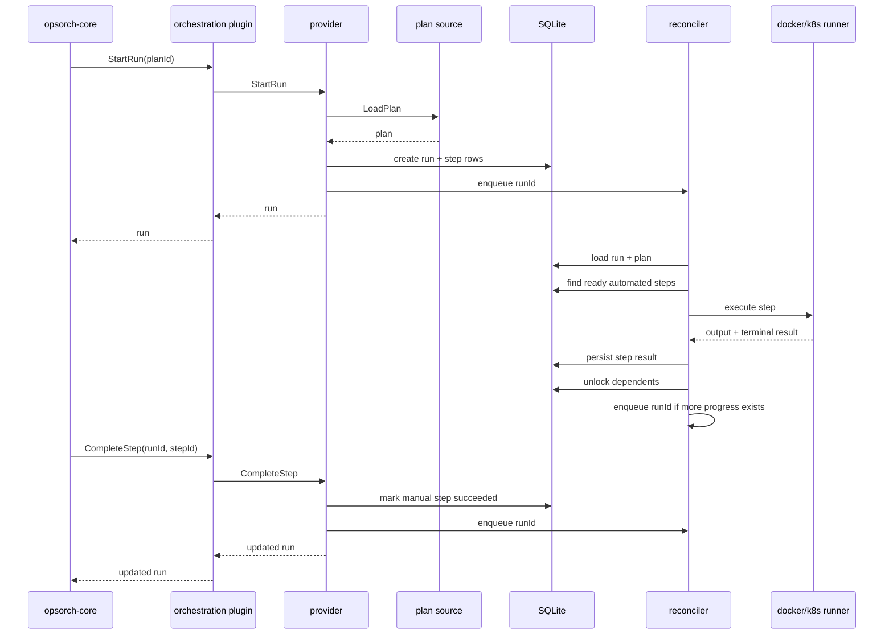

# OpsOrch Orchestration Adapter Design

## Overview

| Area | Implementation |
| --- | --- |
| Plan sources | Local directory or git repository |
| Plan format | Strict YAML |
| Run state | SQLite |
| Step types | `manual`, `automated` |
| Automated execution | Container workload |
| Runners | Local Docker or Kubernetes Job |
| Progress engine | In-process reconciler |

## Architecture

### Components

| Component | Responsibility |
| --- | --- |
| `PlanSource` | Resolves plans from local disk or git cache |
| `PlanManager` | Loads, validates, and queries YAML plans |
| `RunTracker` | Persists runs and step state in SQLite |
| `Provider` | Exposes the orchestration provider interface |
| Reconciler | Reacts to state changes and runs automated steps |
| `LocalRunner` | Executes `docker run` |
| `K8sRunner` | Creates and waits on Kubernetes Jobs |
| Plugin entrypoint | Keeps a long-lived provider process alive for `opsorch-core` |

### Runtime Flow



## Plan Sources

| Source type | Behavior |
| --- | --- |
| `local` | Reads YAML files directly from a configured directory |
| `git` | Clones or refreshes a repository into a local cache, then reads YAML files from that checkout |

Both source types resolve to a local working directory that contains YAML plans.

### Git Source Fields

| Field | Purpose |
| --- | --- |
| Repository URL | Repository to clone |
| Ref or branch | Version of the repository to read |
| Subdirectory | Optional path containing plan files |
| Cache path | Local checkout under adapter storage |

## Plan Model

### Top-Level Plan Fields

| Field | Required | Notes |
| --- | --- | --- |
| `id` | Yes, or filename-derived | If omitted, derived from filename |
| `service` | Yes | Used for scoped retrieval |
| `team` | Yes | Used for scoped retrieval |
| `environment` | Yes | Used for scoped retrieval |
| `title` | Yes | Display title |
| `description` | No | Human-readable summary |
| `version` | No | Plan version |
| `tags` | No | `map[string]string` |
| `steps` | Yes | Ordered list of step definitions |

### Step Fields

| Field | Manual | Automated | Notes |
| --- | --- | --- | --- |
| `id` | Yes | Yes | Unique within the plan |
| `title` | Yes | Yes | Display title |
| `description` | Optional | Optional | Human-readable detail |
| `dependsOn` | Optional | Optional | Dependency list |
| `metadata` | Optional | Optional | Free-form metadata |
| `reasoning` | Optional | No | Operator guidance |
| `exec` | No | Yes | Container execution payload |

### Automated Step Payload

```yaml
exec:
  image: ghcr.io/org/tool:tag
  command: ["tool"]
  args: ["run", "--target", "prod"]
  env:
    KEY: value
```

## YAML Contract

### Canonical Shape

```yaml
id: production-deploy
service: api
team: platform
environment: production
title: Production Deployment
description: Standard production release process
version: "1.0"
tags:
  type: deployment

steps:
  - id: prechecks
    title: Verify Preconditions
    type: manual
    reasoning: Confirm change approval, rollback owner, and maintenance window.

  - id: run-migrations
    title: Run Migrations
    type: automated
    dependsOn: [prechecks]
    exec:
      image: ghcr.io/opsorch/migrations:latest
      args: ["up"]
```

### Contract Rules

| Rule | Status |
| --- | --- |
| Dependencies use `dependsOn` | Enforced |
| Scope uses top-level `service`, `team`, `environment` | Enforced |
| Tags use `map[string]string` | Enforced |
| `author`, `created`, `updated` are excluded from YAML | Enforced |
| Plan ID may be derived from filename | Implemented |

### Validation

| Validation | Behavior |
| --- | --- |
| Plan contains at least one step | Reject invalid plan |
| Step IDs are non-empty and unique | Reject invalid plan |
| Step type is `manual` or `automated` | Reject invalid plan |
| Automated step contains `exec.image` | Reject invalid plan |
| Dependencies reference existing steps | Reject invalid plan |
| Dependency graph is acyclic | Reject invalid plan |

`GetPlan` and `StartRun` return validation errors directly. `QueryPlans` skips invalid YAML files instead of failing the entire query.

## Runtime Model

### Run Statuses

| Run status | Meaning |
| --- | --- |
| `created` | Run has been created |
| `running` | Run has work in progress |
| `blocked` | Run is waiting on manual work or dependencies |
| `completed` | All steps succeeded |
| `failed` | At least one step failed terminally |
| `cancelled` | Run was cancelled |

### Step Statuses

| Step status | Meaning |
| --- | --- |
| `pending` | Waiting for dependencies |
| `ready` | Can be completed or executed |
| `running` | Automated step is currently executing |
| `blocked` | Waiting on a run-managed transition |
| `succeeded` | Step completed successfully |
| `failed` | Step completed unsuccessfully |
| `skipped` | Step was skipped |
| `cancelled` | Step was cancelled |

### Initial Step State

| Condition | Initial state |
| --- | --- |
| Step has no dependencies | `ready` |
| Step has dependencies | `pending` |

### Manual Step Behavior

| Behavior | Implementation |
| --- | --- |
| Operator completes a step | `CompleteStep` |
| Completion metadata | `actor`, `note`, timestamps |
| Downstream transition | Dependents are re-evaluated |
| Human completion of automated step | Rejected |

### Automated Step Behavior

| Transition | Meaning |
| --- | --- |
| `ready -> running` | Reconciler picked up the step |
| `running -> succeeded` | Runner returned success |
| `running -> failed` | Runner returned failure |

Automated execution runs through the reconciler, not inline in the request path.

## Reconciler

### Trigger Sources

| Event | Reconciler action |
| --- | --- |
| `StartRun` | Enqueue run ID |
| `CompleteStep` | Enqueue run ID |
| Automated step completion | Enqueue run ID again |

### Reconciler Behavior

| Behavior | Implementation |
| --- | --- |
| Request path stays non-blocking for automated work | Yes |
| Provider keeps reconciling after request returns | Yes |
| Multiple ready automated steps can run in parallel | Yes |
| Queue is deduplicated by run ID | Yes |
| Runs can be marked for another pass while already reconciling | Yes |

This model relies on a long-lived process. That is how plugin mode works with `opsorch-core`.

## Runners

### Runner Selection

| Runner | Execution mode |
| --- | --- |
| `local` | `docker run --rm ...` |
| `k8s` | Kubernetes Job via `kubectl` |

### Local Runner

| Behavior | Implementation |
| --- | --- |
| Labels container with run ID and step ID | Yes |
| Passes env vars | Yes |
| Uses image, command, and args | Yes |
| Captures combined stdout and stderr | Yes |
| Fails on non-zero Docker exit | Yes |

### Kubernetes Runner

| Behavior | Implementation |
| --- | --- |
| Generates Job manifest | Yes |
| Applies manifest with `kubectl` | Yes |
| Waits for Job completion | Yes |
| Fetches logs | Yes |
| Marks success or failure from terminal result | Yes |

## Provider API Behavior

| API | Behavior |
| --- | --- |
| `QueryPlans` | Loads plans from resolved source and filters by `service`, `team`, `environment` |
| `GetPlan` | Loads and validates one plan by ID |
| `StartRun` | Creates persisted run state and enqueues reconciliation |
| `CompleteStep` | Completes a manual step, updates state, and enqueues reconciliation |
| `GetRun` | Returns persisted run state |
| `QueryRuns` | Returns persisted runs filtered by scope |

### Flow Responsibilities

| Actor | Responsibility |
| --- | --- |
| Human operator | Completes manual steps |
| Reconciler | Starts automated steps and advances the run |
| Runner | Executes the automated container workload |
| Run tracker | Persists the result and current state |

## Persistence

The adapter stores run state in SQLite.

### Persisted Run Data

| Data | Stored |
| --- | --- |
| Run status | Yes |
| Scope fields `service`, `team`, `environment` | Yes |
| Step state | Yes |
| Step type | Yes |
| Manual vs automated classification | Yes |
| Automated step output | Yes |
| Automated step error summary | Yes |
| Runner metadata | Yes, where applicable |
